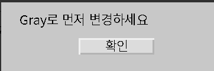
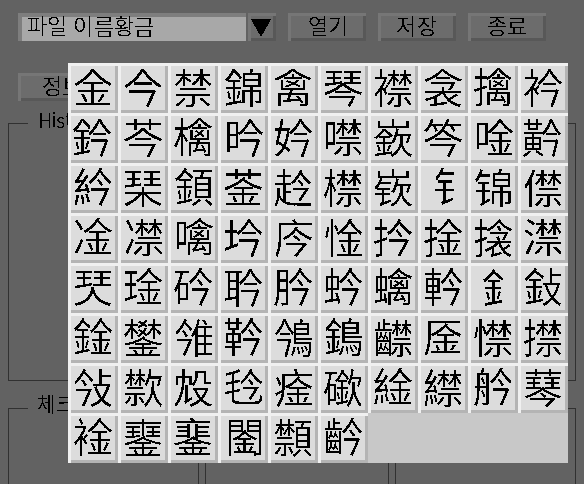
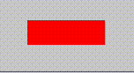
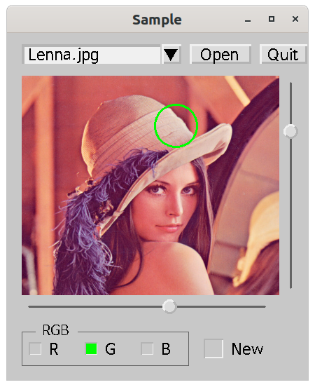

# OpenCV zGUI

## License

LGPL v2

## Features

- based on opencv (C++)  

- Cross platform : can be compiled on every platform that supports opencv

- Easy to use

- Event driven, no polling, less CPU

- ASCII art style GUI compose(you can also make GUI by giving coordinations)

  ```C++
  struct Info : z::AsciiWindow
  {
  	Info() : z::AsciiWindow{R"(
  		W-----------------------------------
  		|
  		|  L0-----------------------------
  		|  ||
  		|
  		|            B0-----------
  		|            |확인|
  		|
  		|)"}
  	{
  		B[0]->click([this] () {popdown(1); });
  		organize_accordingto_zindex();
  	}
  	void set(string s1) {
  		L[0]->text(s1); *this << *L[0]; 
  	}
  };
  ```

  

- fully use modern c++ 

- TextInput : Korean -> Chinese Input Possible(libhangul, CJK font needed)

  

- combine basic widgets to make complicated widgets

  - ComboBox = TextInput + Button + vector<string>
  - Number Spinner = TextInput + Button + Button
  - Tabs = Window + Window + Window + ....
  - RadioButton = CheckBox + CheckBox + CheckBox + ... 

- Make complicated GUI by nesting Windows inside Window

- easily make your own widget : just draw into cv::Mat

  Let's make a wierd button. if we click left half of the button it will turn red, while right half will make it blue.
  
  ```c++
  struct WButton : Widget {
  	  WButton(cv::Rect2i r) : z::Widget{r} {
  		mat_ = widget_color_;
  		gui_callback_[cv::EVENT_LBUTTONUP] = [this](int xpos, int) {
  			if(xpos - x < width / 2) mat_ = cv::Vec3b{0,0,255};
  			else mat_ = cv::Vec3b{255,0,0};
  			update();
  		};
  	}
  };
  ```
  
  
  
  We can use 'Z' to draw custom widget into ascii GUI. 
  
  ```c++
  struct Color : z::AsciiWindow{
  	Color(): z::AsciiWindow{R"(
  		W----------------------------------------------
  		|
  		|       Z0-------
  		|       ||
  		|
  		|)"}
  	{
  		wb.resize(*Z[0]); //position will be copied
  		*this + wb;
  		organize_accordingto_zindex();
  	}
  	WButton wb{{0,0,1,1}}
  }
  ```
  

## Install

```bash
> sudo apt install libhangul-dev libopencv-dev xclip
> git clone --depth=1 https://github.com/ParkSeungwon/opencv-gui
> cd opencv-gui
> make
```

First line of font.dat file should point to CJK font file path.

## Sample Image



## Supported Widgets

- Button
- Label
- Checkbox
- radiobutton
- frame
- Text input
- TextBox
- combo box
- Number spinner
- Image
- Slider
- Progress bar
- Window
- popup window
- Tabs
- ScrolledWindow

## Coordinate System


Top window can scroll to any rectangular position by calling scroll_to() function. Scrolled_rect_ will be shown on the display. All widgets(including Window widget) in herits cv::Rect2i{x, y, width, height}. Basically widget position or mouse event will be calculated by relative position from first parent window. Scrolling will have no effect on these.

## Useful for 

- gui project that needs fast prototyping
- cross platform gui
- gui for opencv parameter tuning


## ASCII drawing Rules

- Capital letter stands for 
  - B : Button
  - C : CheckBox
  - T : Text Input
  - E : Text Box
  - W : Window
  - P : Progress bar
  - S : Slider
  - I : Image
  - L : Label
  - Z : Custom Widget
  
- Capital letter is followed by a number : this should be one digit and it is the index of this widget. You can also use printable ascii characters after 9.(0 1 2 3 4 5 6 7 8 9 : ; < = > ? @ A B C D E .... | } ~)
- Capital letter is followed by '------' : this determines the width of the widget.
- Capital letter is followed by '|' vertically : this determines the height of the widget
- the first line below the Capital letter contains some text and close with another ''|''
  - this is the text of the widget 
  - Exceptionally in slider widget, it is start, end, step separated by space.
  - in Checkbox widget, v should be used to indicate that it is checked.
- Window size should include all the child widgets.

## Widget Hierachy


## Tutorial

#### 1. Hello World

```c++
#include<iostream>
#include"src/zgui.h"
using namespace std;

struct Win : z::AsciiWindow 
{
	Win() : z::AsciiWindow{R"(
	  WHello World----------------
	  | T0-------------------
	  | |Enter your name|
	  | B0-------------
	  | |Hello|
	  |)"}
	{
		start();
		B[0]->click([this]() { cout << "Hello " << T[0]->value() << endl; });
	}
};

int main() {
	Win win;
	win.loop();
}
```


#### 2. Basic Widget Gallery

```c++
#include"src/zgui.h"
using namespace std;

struct Win : z::AsciiWindow 
{
	Win() : z::AsciiWindow{R"(
		WBasic Widget Gallery------------------
		|  L0-----B0-------C0- T0--------------
		|  |Label||Button| |v| |TextInput| 
		|  S0---------------  P0-------------
		|  |1 100 1|          |333|
		|  E0---------------------------------
		|  |Text Box|
		|  |
		|  |
		|)"}
	{
		start();
	}
};

int main() {
	Win win;
	win.loop();
}
```


#### 3. Combined Widgets

```c++
#include<iostream>
#include"src/zgui.h"
using namespace std;

struct Win : z::AsciiWindow 
{
	Win() : z::AsciiWindow{R"(
		WCombined Widgets----------------
		|  T0-------------B0  T1------B1
		|  ||             ||  ||      B2
		|
		|
		|    C0-   C1-   C2-    B3------
		|    ||    ||    |v|    |values|
		|)"}
	{
		static vector<string> v{"abc", "def", "ghi"};
		tie(*T[0], *B[0], v, 30);
		auto f1 = tie(*T[1], *B[1], *B[2], 0, 1);
		auto f2 = tie(*C[0], *C[1], *C[2]);
		wrap("Radio Button", 20, 10, *C[0], *C[1], *C[2]);
		start();
		B[3]->click([this, f1, f2]() {
			cout << "combo box value : " << T[0]->value() << endl;
			cout << "Number spinner value: " << f1() << endl;
			cout << "Radio button value: " << f2() << endl;
		});
	}
};


int main() {
	Win win;
	win.loop();
}
```


#### 4. Tabs

```c++
#include"src/zgui.h"
using namespace std;

struct Win : z::Window 
{
	struct Tab1 : z::AsciiWindow {
		Tab1() : z::AsciiWindow{R"(
			WTab1----------------
			|
			|
			|   L0-------------
			|   |TAB1|
			|
			|)"}
		{ 
			organize_accordingto_zindex(); 
		}
	} tab1;
	struct Tab2 : z::AsciiWindow{
		Tab2() : z::AsciiWindow{R"(
		  WTab2------------------
			|
			|
			|   L0--------------
			|   |TAB2|
			|
			|)"}
		{ 
			organize_accordingto_zindex();
		}
	} tab2;
	Win() : z::Window{"Tab Example", {0, 0, 300, 200}}
	{
		tabs(10, 10, tab1, tab2);
		start();
	}
};


int main() {
	Win win;
	win.loop();
}
```


## Reference

[Documentation](http://gui.zeta2374.com)

#### Widget

```c++
Widget(cv::Rect_<int> r);
```

widget will be visible with the size and position of rectangle r

```c++
bool focus();
```

check if widget is currently focused or not. Focused widget will get the keyboard input.

```c++
void focus(bool true_or_false);
```

set focus

#### Label

```c++
Label(std::string text, cv::Rect2i r);
```

Label will be created with text at the position r;

```c++
void text(std::string s);
```

sets the text as s;

```c++
std::string text();
```

gets the text of a label.

#### Button

```c++
Button(std::sting t, cv::Rect_<int> r);
```

Button with text t at position and size of r;

```c++
void click(std::function<void()> f);
```

sets the function to be executed when the button is clicked.

```c++
void text(std::string s);
```

sets the button text

#### CheckBox

```c++
CheckBox(cv::Rect2i r);
```

create a checkbox with position and size of r

```c++
void click(std::function<void()> f);
```

sets the function to be executed when the button is clicked.

```c++
void text(std::string s);
```

sets the text of checkbox

#### TextInput

```c++
TextInput(cv::Rect2i r);
```

create a TextInput with position and size of r

```c++
std::string value();
```

gets the text inside the text input

```c++
void value(std::string s);
```

sets the text inside the text input

```c++
void enter(std::function<void(std::string)> f);
```

sets the function to be executed when the keyboard enter is pushed.

#### Window

```c++
Window(std::string title, cv::Rect_<int> r);
```

create a window with title and position and size of r

```c++
void show();
```

show all the child widgets in the window

```c++
Window &operate+(Widget &w);
```

add a child widget to this window

```c++
Window &operator<<(Widget &r);
```

update and show a Widget r in this window

```c++
int loop();
```

start main loop. Keyboard input is processed with this function.

```c++
void close();
```

close this window

```c++
void start(int flag = cv::WINDOW_NORMAL | cv::WINDOW_KEEPRATIO);
```

show the window and process the mouse event.

This should be called after all the child widgets are created.

```c++
void keyboard_callback(int key);
```

```c++
void update(const Widget &r);
```

refresh widget r.

```c++
std::string title();
```

get the title of the window

```c++
void resize(cv::Rect2i r);
```

resize the window

```c++
void tie(std::string title, int font, TextInput &t, Button &b, std::vector<std::string> v, int x = -1, int y = -1);
```

create a combo box by tying textinput t and button b. 

a popup window will appear with buttons of all the string in vector v.

you can specify the place where the popup will appear with x and y.

```c++
void tie(TextInput &t, Button &b1, Button &b2, double start = 0, double step = 1);
```

create a numeric spin button by tying a textinput and two button.

start is the number you begin with.

step will be the amount to change when you click the button.

```c++
template<class... T>
void wrap(const char *title, int font, int N, const T&... widgets);
```

create a frame by wraping many widgets.

```c++
template<class... T> void tie(T&... checks);
```

create a radiobutton group by combining many check boxes.

```c++
void popup(Window &w, std::function<void(int)> f = [](int){});
```

show popup window on w.

When x, y of this this->window is 0, it will draw the popup window at the center of w.

functor with value will be call when popdown is called.

```c++
void popdown(int value);
```

hide popup window and execute functor registered with  popup function passing integer value.

```c++
Window &operator+(Widget &w);
```

register widget w as child widget of this window.

push w into widgets_ vector.

```c++
Window &operator-(Widget &w);
```

remove widget from widgets_;

```c++
Window &operator<<(Widget &w);
```

copy mat_ of widget into Window mat_, according to x, y position.

```c++
Window &operator>>(Widget &w);
```

remove widget from mat_;

also calculates zIndex, alpha and do the appropriate job.

#### ScrolledWindow

scrollable window.

inherits Window, inherited by AsciiWindow.

#### Handle

add handle for scrolling. scrolledwindow + handle

#### Image

```c++
Image(cv::Rect2i r);
```

create a Image with position and size of r

```c++
cv::Mat &operator=(const cv::Mat &r);
```

gets the image from matrix r

#### Slider

```c++
Slider(cv::Rect2i r, int start, int stop, int step);
```

create a slider widget with size and position of r.

```c++
int value();
```

get the current value

```c++
void value(int v);
```

set the value

```c++
void on_change(std::function<void(int)> f);
```

sets the function to execute on slider change event

```c++
void draw();
```

draw the slider

#### Progress

```c++
Progress(cv::Rect2i r);
```

create a widget with size and position of r.

```c++
int value();
```

get the current value

```c++
void value(int v);
```

set the value

#### AsciiWindow

```c++
AsciiWindow(const char *asciiart, int unit_width = 10, int unit_height = 15, int margin = 1);
```

create a Asciiwindow with asciiart string.

unit_width : one character of - is equivalent of this value

unit_height : one character of | is equivalent of this value

margin : default margin for the window

#### PopupInterface(deprecated)

```c++
PopupInterface(Window *p);
```

sets a popup interface to window p

```c++
int open(int flag = cv::WINDOW_AUTOSIZE), int x = -1, int y = -1);
```

open a popup window with flag.

when the pop up window closes with quit(k), this function returns k.

popup appearing position can be set manually with x, y

```c++
void quit(int r);
```

popup window will collapse and return r
