# OpenCV zGUI

## License

LGPL v2

## Features

- based on opencv (C++)  

- Cross platform : can be compiled on every platform that supports opencv

- Easy to use

- Event driven, no polling, less CPU

- ASCII art style GUI compose(you can also make GUI by giving coordinations)

  ```c++
  #include<iostream>
  #include"src/zgui.h"
  using namespace std;
  
  struct Win : z::AsciiWindow 
  {
    Win() : z::AsciiWindow{R"(
      WHello World----------------
  	| T0-------------------
  	| |Enter your name|
  	| B0-------------
  	| |Hello|
  	|)"}
    {
  	start();
  	B[0]->click([this]() { 
        cout << "Hello " << T[0]->value() << endl; });
    }
  };
  
  int main() {
  	Win win;
  	win.loop();
  }
  ```
  

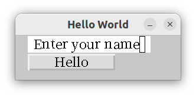


- fully use modern c++ 

- TextInput : Korean -> Chinese Input Possible(libhangul, CJK font needed)

  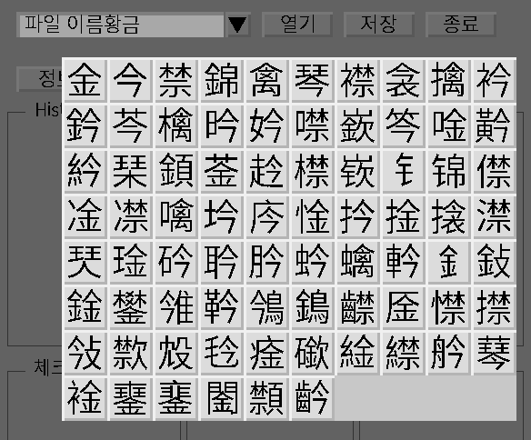

- combine basic widgets to make complicated widgets

  - ComboBox = TextInput + Button + vector<string>
  - Number Spinner = TextInput + Button + Button
  - Tabs = Window + Window + Window + ....
  - RadioButton = CheckBox + CheckBox + CheckBox + ... 

- Make complicated GUI by nesting Windows inside Window

- easily make your own widget : just draw into cv::Mat

  Let's make a wierd button. if we click left half of the button it will turn red, while right half will make it blue.
  
  ```c++
  struct WButton : Widget {
  	  WButton(cv::Rect2i r) : z::Widget{r} {
  		mat_ = widget_color_;
  		gui_callback_[cv::EVENT_LBUTTONUP] = [this](int xpos, int) {
  			if(xpos - x < width / 2) mat_ = cv::Vec3b{0,0,255};
  			else mat_ = cv::Vec3b{255,0,0};
  			update();
  		};
  	}
  };
  ```
  
  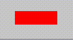
  
  We can use 'Z' to draw custom widget into ascii GUI. 
  
  ```c++
  struct Color : z::AsciiWindow{
  	Color(): z::AsciiWindow{R"(
  		W----------------------------------------------
  		|
  		|       Z0-------
  		|       ||
  		|
  		|)"}
  	{
  		wb.resize(*Z[0]); //position will be copied
  		*this + wb;
  		organize_accordingto_zindex();
  	}
  	WButton wb{{0,0,1,1}}
  }
  ```
  

## Install

```bash
> sudo apt install libhangul-dev libopencv-dev xclip
> git clone --depth=1 https://github.com/ParkSeungwon/opencv-gui
> cd opencv-gui
> make
```

First line of font.dat file should point to CJK font file path.

## Sample Image

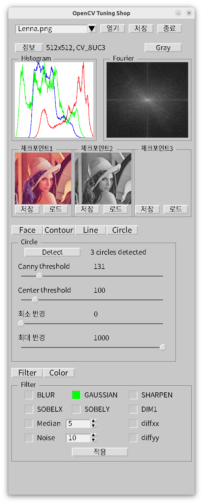

## Supported Widgets

- Button
- Label
- Checkbox
- radiobutton
- frame
- Text input
- TextBox
- combo box
- Number spinner
- Image
- Slider
- Progress bar
- Window
- popup window
- Tabs
- ScrolledWindow

## Coordinate System


Top window can scroll to any rectangular position by calling scroll_to() function. Scrolled_rect_ will be shown on the display. All widgets(including Window widget) in herits cv::Rect2i{x, y, width, height}. Basically widget position or mouse event will be calculated by relative position from first parent window. Scrolling will have no effect on these.

## Useful for 

- gui project that needs fast prototyping
- cross platform gui
- gui for opencv parameter tuning


## ASCII drawing Rules

- Capital letter stands for 
  - B : Button
  - C : CheckBox
  - T : Text Input
  - E : Text Box
  - W : Window
  - P : Progress bar
  - S : Slider
  - I : Image
  - L : Label
  - Z : Custom Widget
  
- Capital letter is followed by a number : this should be one digit and it is the index of this widget. You can also use printable ascii characters after 9.(0 1 2 3 4 5 6 7 8 9 : ; < = > ? @ A B C D E .... | } ~)
- Capital letter is followed by '------' : this determines the width of the widget.
- Capital letter is followed by '|' vertically : this determines the height of the widget
- the first line below the Capital letter contains some text and close with another ''|''
  - Usuall this is the text of the widget 
  - In slider widget, it is start, end, step separated by space.
  - in Checkbox widget, 'v' should be used to indicate that it is checked.
- Window size should include all the child widgets.
- never use tabs inside window.  Only use space.
- pitfall: if you use n CJK characters inside | |, next opening '|' should be n spaces away from closing '|'. |한글이다| <---at least 4space --> |next|
- any number after capital letters should not leap. (B0, B2 : error) (B0, B2, B1: ok). But appearing sequence does not matter.

## Widget Hierachy

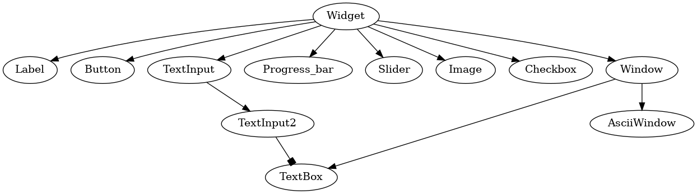

## Tutorial


#### 1. Basic Widget Gallery

```c++
#include"src/zgui.h"
using namespace std;

struct Win : z::AsciiWindow 
{
	Win() : z::AsciiWindow{R"(
		WBasic Widget Gallery------------------
		|  L0-----B0-------C0- T0--------------
		|  |Label||Button| |v| |TextInput| 
		|  S0---------------  P0-------------
		|  |1 100 1|          |333|
		|  E0---------------------------------
		|  |Text Box|
		|  |
		|  |
		|)"}
	{
		start();
	}
};

int main() {
	Win win;
	win.loop();
}
```

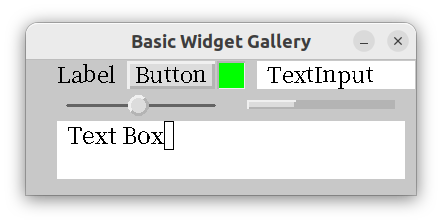

#### 2. Combined Widgets

```c++
#include<iostream>
#include"src/zgui.h"
using namespace std;

struct Win : z::AsciiWindow 
{
	Win() : z::AsciiWindow{R"(
		WCombined Widgets----------------
		|  T0-------------B0  T1------B1
		|  ||             ||  ||      B2
		|
		|
		|    C0-   C1-   C2-    B3------
		|    ||    ||    |v|    |values|
		|)"}
	{
		static vector<string> v{"abc", "def", "ghi"};
		tie(*T[0], *B[0], v, 30);
		auto f1 = tie(*T[1], *B[1], *B[2], 0, 1);
		auto f2 = tie(*C[0], *C[1], *C[2]);
		wrap("Radio Button", 20, 10, *C[0], *C[1], *C[2]);
		start();
		B[3]->click([this, f1, f2]() {
			cout << "combo box value : " << T[0]->value() << endl;
			cout << "Number spinner value: " << f1() << endl;
			cout << "Radio button value: " << f2() << endl;
		});
	}
};


int main() {
	Win win;
	win.loop();
}
```

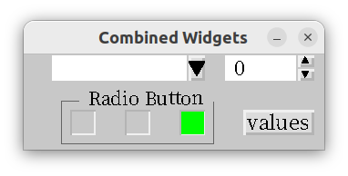

#### 3. Tabs

```c++
#include"src/zgui.h"
using namespace std;

struct Win : z::Window 
{
	struct Tab1 : z::AsciiWindow {
		Tab1() : z::AsciiWindow{R"(
			WTab1----------------
			|
			|
			|   L0-------------
			|   |TAB1|
			|
			|)"}
		{ 
			organize_accordingto_zindex(); 
		}
	} tab1;
	struct Tab2 : z::AsciiWindow{
		Tab2() : z::AsciiWindow{R"(
		  WTab2------------------
			|
			|
			|   L0--------------
			|   |TAB2|
			|
			|)"}
		{ 
			organize_accordingto_zindex();
		}
	} tab2;
	Win() : z::Window{"Tab Example", {0, 0, 300, 200}}
	{
		tabs(10, 10, tab1, tab2);
		start();
	}
};


int main() {
	Win win;
	win.loop();
}
```

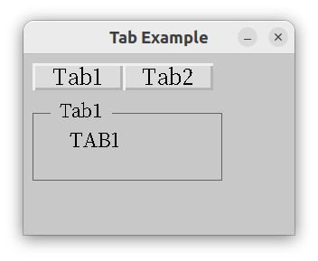

#### 4. Scrolled Window

```c++
#include"src/zgui.h"
using namespace std;

struct Win : z::Window 
{
	Win() : z::Window{"Scrolled Window Example", {0, 0, 800, 800} }
	{
		scroll_to({0, 0, 400, 400});// before adding handle
		*this + label + handle;
		start();
    }
	z::Handle handle;
	z::Label label{"Center", {300, 300, 100, 30}};
};

int main() {
	Win win;
	win.loop();
}
```

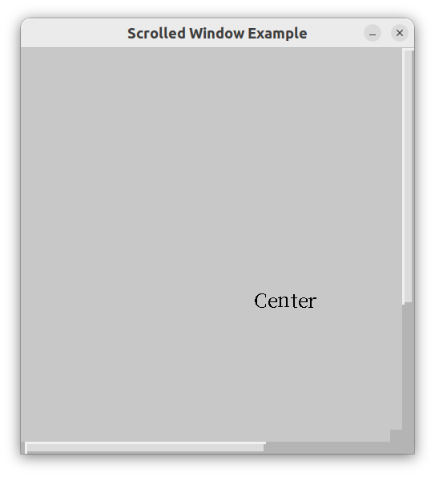

#### 5. Popup Window

```c++
#include<iostream>
#include"src/zgui.h"
using namespace std;

struct Popup : z::AsciiWindow
{
	Popup() : z::AsciiWindow {R"(
		W-----------
		|
		|  B0-----
		|  |OK|
		|)"}
	{
		organize_accordingto_zindex();
		B[0]->click([this]() { popdown(7); });
	} 
};

struct Win : z::AsciiWindow 
{
	Popup pop;
	Win() : z::AsciiWindow{R"(
	  WPopup Example----------
		|
		|   B0--------------
		|   |Popup|
		|
		|)"}
	{
		start();
		B[0]->click( [this]() { 
			pop.popup ( *this , [](int i) { cout << i << endl;} );//7
		});
	}
};

int main() {
	Win win;
	win.loop();
}
```

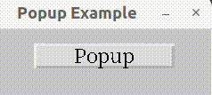

#### 6. Multiple Windows

```c++
#include<iostream>
#include"src/zgui.h"
using namespace std;

struct NewWin : z::AsciiWindow
{
	NewWin() : z::AsciiWindow{R"(
    WNew------------------
		|  B0----------------
		|  |A new window|
		|)"}
	{
		organize_accordingto_zindex();
		B[0]->click([this](){quit(7);});
	}
};

struct Win : z::AsciiWindow
{
	Win() : z::AsciiWindow{R"(
	  WMultiple Window example------------
		|
		|  B0---------------
		|  |New Window|
		|)"}
	{
		start();
		B[0]->click([this]() { if(w.open()==7) cout << "closed" << endl; });
	}
	NewWin w;
};

int main() {
	Win win;
	win.loop();
}
```

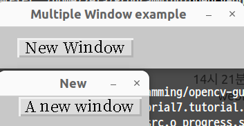

#### 7. Window with normal cv::Mat

If you want to get mouse event or keyboard event with opened cv::Mat. You should make a window and use 'load_matrix', 'open' function. If you don't want to get event from the cv::Mat, just use imshow("title", matrix). 

```c++
#include<iostream>
#include"src/zgui.h"
using namespace std;

struct NewWin : z::Window
{
	NewWin() : z::Window{"title", {0,0,1,1}}
	{
		gui_callback_[cv::EVENT_LBUTTONUP] = [this](int x, int y) {
			cv::circle(mat_, {x, y}, 30, {255, 0, 0}, 3);
			show();
		};
	}
};

struct Win : z::AsciiWindow
{
	Win() : z::AsciiWindow{R"(
	  WMatrix Window exmaple------------
		|
		|  B0----------------------
		|  |Window with event|
		|
		|  B1-----------------------
		|  |Just show the image|
		|)"}
	{
		start();
		B[0]->click([this]() { 
            w.load_matrix( cv::imread("Lenna.png")); 
            w.open(); 
        });
		B[1]->click([this]() { imshow("image", cv::imread("len.jpg")); });
	}
	NewWin w;
};

int main() {
	Win win;
	win.loop();
}
```

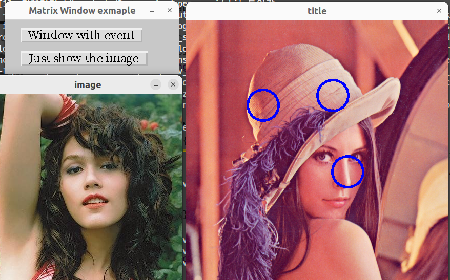

#### 8. Integration with Profactor CvPlot

```C++
#include"CvPlot/cvplot.h"
#include"src/zgui.h"
using namespace std;

struct Win : z::AsciiWindow
{
	Win() : z::AsciiWindow{R"(
	  WIntegration with CvPlot----------------------
		|
		|  I0------------------------------ B0------
		|  |Lenna.png|                      |Quit|
		|  |
		|  |                                B1------
		|  |                                |Plot|
		|  |
		|  |                  
		|  |                 
		|  |
		|  |
		|  |
		|  |
		|  |
		|  |
		|  |
		|
		|)", 20, 30}
	{
		start();
		B[0]->click([this]() { cv::destroyAllWindows(); });
		B[1]->click([this]() { 
			auto axes = CvPlot::plot(std::vector<double>{ 3, 3, 4, 6, 4, 3 }, "-o");
			*I[0] = axes.render(I[0]->height, I[0]->width);
			I[0]->update();
		});
	}
};

int main() {
	Win win;
	win.loop();
}
```

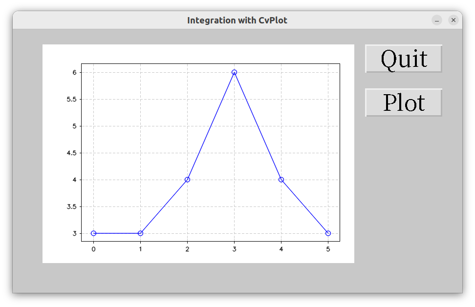

## Reference

[Documentation](http://gui.zeta2374.com)
